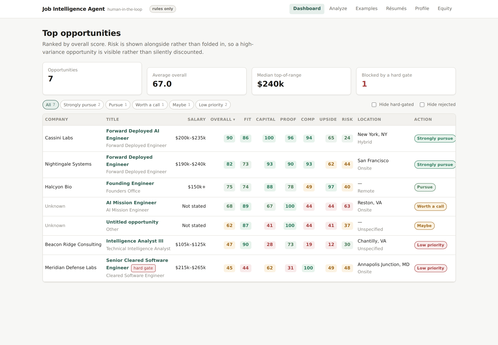
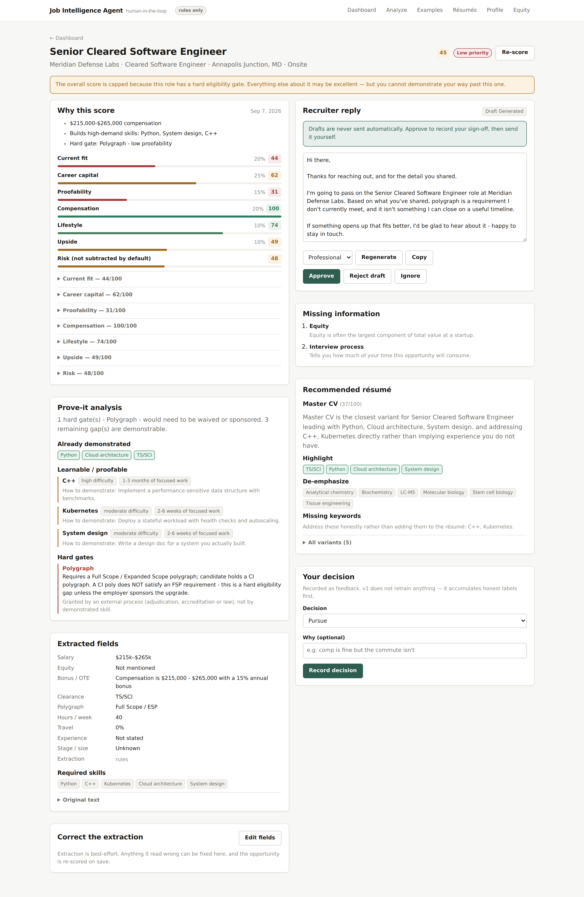
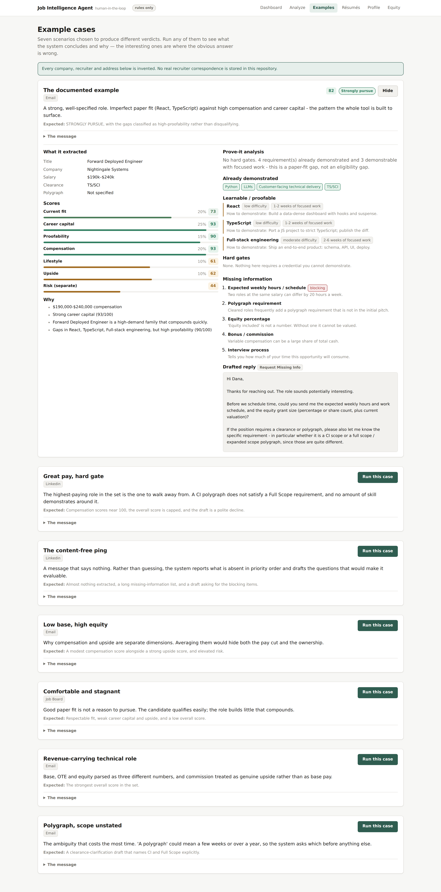
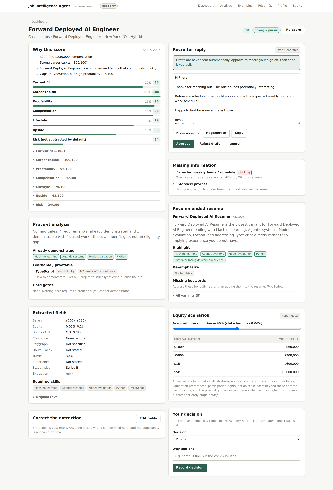
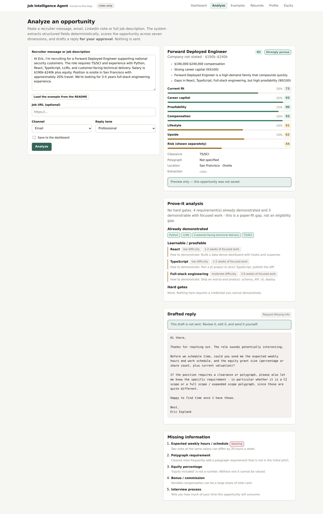

# Job Intelligence Agent

Paste a recruiter message. Get structured data, seven transparent scores, an
honest read on whether your gaps are actually barriers, and a drafted reply
waiting for your approval.

[](https://github.com/TheScienceCo/Curated/actions/workflows/ci.yml)



---

## The problem this solves

A recruiter message is a compressed, incomplete, and slightly adversarial
document. It usually omits the compensation, hides the schedule, says
"polygraph" without saying which one, and asks you to spend an hour on a call
to find out. Meanwhile the thing that actually determines whether an
opportunity is worth pursuing — *would this make me more valuable in two
years?* — appears nowhere in it at all.

The instinct is to triage by paper fit: do I have the listed years and skills?
That instinct is wrong, and it is expensive. It rejects high-value roles over
gaps you could close in a fortnight, and it accepts comfortable roles that
teach you nothing.

**This tool is built around a different question:**

> Is this opportunity valuable enough to spend time on, and are my missing
> qualifications actually barriers — or merely things I have not yet proved?

The distinction it insists on is between a gap you can *demonstrate* your way
past and a gap you *cannot*:

> **Missing requirement: 5 years TypeScript.**
> High proofability — a technical interview and public projects can offset it.

> **Missing requirement: Full Scope Polygraph.**
> Low proofability — a hard eligibility mismatch unless the employer sponsors
> the upgrade. A CI polygraph does **not** satisfy this.

High compensation + high career capital + imperfect paper fit + high
proofability = a high-priority opportunity. The whole system is built to
surface exactly that pattern.

---

## What it does

| | |
| --- | --- |
| **Extracts** | Salary, equity, bonus/OTE, clearance, polygraph *type*, remote posture, location, travel, weekly hours, on-call, YOE, skills, education, citizenship, company stage, ownership level, customer-facing intensity — each with a confidence level |
| **Scores** | Seven independent 0–100 dimensions, each with its reasons shown |
| **Classifies gaps** | Already demonstrated / learnable-and-proofable / hard gate, with a concrete project and a time estimate for every learnable item |
| **Detects omissions** | Priority-ordered list of what the recruiter did not tell you |
| **Drafts a reply** | Tone-selectable, asking for exactly what is missing — for your approval, never sent |
| **Recommends a résumé** | Which variant to send, what to lead with, what to shorten, and which keywords to address honestly rather than insert |
| **Models equity** | Dilution-adjusted scenarios, clearly labelled hypothetical |
| **Corrects itself** | Every extracted field is editable; a correction is marked high-confidence and re-scores the opportunity immediately |
| **Records decisions** | Every pursue/reject/interview/offer becomes a labelled example |

---

## Quick start

```bash
git clone https://github.com/TheScienceCo/Curated.git
cd Curated
cp .env.example .env          # works as-is; no API key required
docker compose up --build
```

* Web UI — <http://localhost:3000>
* API docs — <http://localhost:8000/docs>

The database seeds itself with a fictional demo dataset on first start, so the
dashboard has something in it immediately.

**No API key is needed.** The default `LLM_PROVIDER=mock` runs the deterministic
pipeline, which is what produces every number in this README. Setting
`ANTHROPIC_API_KEY` (or `OPENAI_API_KEY`) and `LLM_PROVIDER` adds the
language-understanding layer on top; it never overrides the deterministic
fields.

### Without Docker

```bash
make venv                     # backend virtualenv
make test                     # 272 tests, ~5s, no database needed
make demo                     # score the documented example and print it

# Then, in two terminals:
make api                      # needs Postgres, or set DATABASE_URL=sqlite:///dev.db
make web
```

Run `make` on its own to list every target.

---

## Example: end to end

**Input**

> Hi Eric, I'm recruiting for a Forward Deployed Engineer supporting national
> security customers. The role requires TS/SCI and experience with Python,
> React, TypeScript, LLMs, and customer-facing technical delivery. Salary is
> $190k–$240k plus equity. Position is onsite in San Francisco with
> approximately 20% travel. We're looking for 3–5 years full-stack engineering
> experience.

**Output** (`make demo` — verbatim, produced with no API key)

```
EXTRACTED
  Salary        $190,000 – $240,000
  Clearance     ts_sci
  Polygraph     unknown
  Location      San Francisco (onsite)
  Travel        20%
  Experience    3.0 years
  Skills        python, react, typescript, llms, customer_facing, fullstack
  Job family    forward_deployed_engineer

SCORES
  Current fit         73  ██████████████
  Career capital      93  ██████████████████
  Proofability        90  █████████████████
  Compensation        93  ██████████████████
  Lifestyle           61  ████████████
  Upside              62  ████████████
  Risk (separate)     44  ████████

  OVERALL           82.3  →  STRONGLY_PURSUE

WHY
  • $190,000-$240,000 compensation
  • Strong career capital (93/100)
  • Forward Deployed Engineer is a high-demand family that compounds quickly.
  • Gaps in React, TypeScript, Full-stack engineering, but high proofability (90/100)

PROVE-IT
  No hard gates. 4 requirement(s) already demonstrated and 3 demonstrable with
  focused work - this is a paper-fit gap, not an eligibility gap.
  → React: 1-2 weeks of focused work — Build a data-dense dashboard with hooks and suspense.
  → TypeScript: 1-2 weeks — Port a JS project to strict TypeScript; publish the diff.
  → Full-stack engineering: 2-6 weeks — Ship an end-to-end product: schema, API, UI, deploy.

MISSING INFORMATION
  2. Expected weekly hours / schedule
  7. Polygraph requirement
  8. Equity percentage
  9. Bonus / commission
  10. Interview process

DRAFTED REPLY (for human approval — nothing is sent)
  | Hi there,
  |
  | Thanks for reaching out. The role sounds potentially interesting.
  |
  | Before we schedule time, could you send me the expected weekly hours and
  | work schedule, and the equity grant size (percentage or share count, plus
  | current valuation)?
  |
  | If the position requires a clearance or polygraph, please also let me know
  | the specific requirement - in particular whether it is a CI scope or a full
  | scope / expanded scope polygraph, since those are quite different.
  |
  | Happy to find time once I have those.
  |
  | Best,
  | Eric Espland
```

### The contrast case

The same pipeline on a better-paying job the candidate cannot take:



$215k–$265k, compensation scores **100/100** — and the overall score is capped
at 45 with a drafted polite decline, because the role requires a Full Scope
polygraph and the candidate holds a CI polygraph. Those are not the same
credential, and the system will never treat them as one.

### Seven cases, seven verdicts

The **Examples** tab runs any of the demo scenarios through the real pipeline
in preview mode — nothing is saved unless you ask — and shows what it concluded
and why.



| Case | What it demonstrates |
| --- | --- |
| The documented example | Imperfect paper fit against high compensation and career capital — the pattern the tool exists to surface |
| Great pay, hard gate | The best-paying role in the set is the one to walk away from |
| The content-free ping | A message that says nothing: report what is absent rather than guess |
| Low base, high equity | Why compensation and upside are separate dimensions |
| Comfortable and stagnant | Good paper fit is not a reason to pursue |
| Revenue-carrying technical role | Base, OTE and equity parsed as three different numbers |
| Polygraph, scope unstated | The ambiguity that costs the most time, asked about first |

---

## The scoring philosophy

Seven dimensions, each 0–100, each computed by ordinary arithmetic over
extracted facts, each carrying the reasons for its number.

| Dimension | The question it answers | Default weight |
| --- | --- | --- |
| **Current fit** | Can I do this on paper today? | 20% |
| **Career capital** | If I do this well for 24 months, how much more valuable am I? | 25% |
| **Proofability** | Are my gaps demonstrable, or are they gates? | 15% |
| **Compensation** | How does this sit against *my* bands, not the market's? | 20% |
| **Lifestyle** | Hours, travel, remote, on-call — as stated, not assumed | 10% |
| **Upside** | Is there a credible path to $300k / $500k / $1M+? | 10% |
| **Risk** | What could go wrong? | *shown separately* |

Five decisions worth defending:

**Career capital outweighs current fit.** The heaviest weight goes to what the
role does to your future value, because that is the factor people most reliably
under-weight when a salary number is in front of them.

**The overall score is weighted, not averaged.** Averaging seven numbers
launders away the thing you needed to know. Weights are configurable per
candidate in the UI.

**Risk is shown, not subtracted.** A high-risk, high-upside role is a
legitimate choice — but only if you can see you are making it. Set
`risk_penalty_weight` above zero to subtract it.

**Missing years are discounted when the skills are demonstrable.** A "5 years
required" bar against a candidate with the skills and three years is a
negotiation, not a disqualification. A hard gate is different, and caps the
overall score outright.

**Compensation is scored against your bands.** `<$120k` poor, `$150k`
acceptable, `$200k` strong, `$250k+` excellent — all editable. Unstated
compensation scores as a neutral unknown rather than a zero, because "they
haven't said" is a question to ask, not a verdict.



---

## Human-in-the-loop safety

**No code path in this repository sends anything outbound.** No email client,
no LinkedIn automation, no webhook.

The system drafts, stores the draft with status `draft_generated`, and stops.
A human approves, edits, rejects or ignores it. "Approved" means *the user is
happy to send this themselves* — sending stays a manual act in their own mail
client. Automation is left out of v1 rather than shipped disabled.

Three further guardrails:

* **The generated draft is never overwritten.** Your edits are stored in
  `approved_response`; `response_draft` keeps what the system actually wrote,
  so the record stays auditable.
* **A sign-off survives regeneration.** Asking for a new draft after approving
  one will not silently discard the approval.
* **The model cannot delete your questions.** LLM polishing is verified: if the
  polished draft drops a question the template asked (say, the salary range),
  the polished version is discarded and the template is used.

---

## Stack

**Backend** — Python 3.11 · FastAPI · Pydantic v2 · SQLAlchemy 2.0 · PostgreSQL
**Frontend** — Next.js 15 (App Router) · React 19 · TypeScript (strict), no UI framework
**AI** — provider-agnostic abstraction over Anthropic and OpenAI-compatible APIs, with structured outputs and a no-credentials mock
**Infra** — Docker · Docker Compose · GitHub Actions

Full detail in **[docs/architecture.md](docs/architecture.md)**, including the
system diagram and the deterministic/LLM split.

The short version: money, clearance, polygraph, scoring and hard gates are
handled by rules, because they have exactly one correct answer and a confidently
wrong model answer would be worse than none. The LLM handles what regexes
cannot — prose, seniority, ownership, customer type — and is optional
throughout.

---

## Example workflow

1. **Set up your profile** — clearance, skills, target roles, salary bands,
   score weights. Seeded with a demo profile so there is something to look at.
2. **Add your résumé variants** — Master CV, FDE, MLE, Cyber, Intelligence.
   Skills are mined from the text at save time, so you can see exactly what the
   system thinks each variant proves.
3. **Paste a recruiter message** into `/analyze` — or start from `/examples`
   and run one of the seven demo scenarios. Analyse without saving to preview,
   or save it to the dashboard.
4. **Read the score breakdown.** Expand any dimension to see the reasons and
   their point contributions.
5. **Check the prove-it analysis.** Learnable gaps come with a project and a
   time estimate; hard gates come with an explanation of why they are hard.
6. **Fix anything it read wrong.** "Correct the extraction" opens an edit form
   over every field. Changing the polygraph from *unspecified* to *full scope*
   takes the verdict from Strongly pursue to Low priority on save — which is
   the point of making it editable rather than disclaiming it.
7. **Review the draft.** Change the tone, regenerate, edit it, then approve —
   and send it yourself.
8. **Record your decision.** Pursue, reject, interviewed, offer, accepted. Each
   one is stored as feedback.



---

## Configuration

Everything is environment-driven; see [`.env.example`](.env.example).

| Variable | Default | Notes |
| --- | --- | --- |
| `LLM_PROVIDER` | `mock` | `mock` \| `anthropic` \| `openai` |
| `ANTHROPIC_API_KEY` | — | Needed only for `LLM_PROVIDER=anthropic` |
| `OPENAI_API_KEY` | — | Needed only for `LLM_PROVIDER=openai` |
| `OPENAI_BASE_URL` | — | Point at any OpenAI-compatible gateway |
| `EMBEDDINGS_ENABLED` | `false` | Adds semantic résumé matching |
| `DATABASE_URL` | assembled from `POSTGRES_*` | `sqlite:///dev.db` works for local runs |
| `SEED_ON_STARTUP` | `true` | Loads the demo dataset if the database is empty |

No secrets are committed. `.env` is git-ignored; only `.env.example` is tracked.

---

## Tests

```bash
make test        # 272 tests
make coverage    # with a coverage report
make lint        # ruff + tsc + eslint
```

The suite runs against in-memory SQLite with the deterministic pipeline: no
database service, no API credentials, ~5 seconds. Coverage is weighted toward
the parts where being wrong is expensive:

| Area | What is asserted |
| --- | --- |
| `test_clearance.py` | Every clearance and polygraph form, and the CI≠FSP invariant from six angles |
| `test_extraction.py` | Salary/equity/travel/hours/YOE parsing, alias normalisation, mining false-positives, LLM-merge precedence |
| `test_scoring.py` | Each dimension's behaviour, hard-gate capping, weight configurability, score bounds, and the product thesis |
| `test_missing_info_and_drafts.py` | Priority ordering, every draft intent and tone, and the polish guardrail |
| `test_api.py` | Every endpoint, error shape, the sign-off-survives-regeneration rule, and that a corrected polygraph changes the verdict |
| `test_acceptance.py` | The documented example, end to end through the API |
| `test_seed.py` | The demo dataset still demonstrates what this README claims |

---

## Demo dataset

`data/samples/` holds seven fictional recruiter messages chosen to exercise
different verdicts: the documented example, a high-paying role gated by a
full-scope polygraph, a content-free "exciting opportunity" ping, a low-base
high-equity founding role, a stagnant contracting role, a commission-carrying
FDE role, and one with an ambiguously-specified polygraph.

All companies, recruiters and email addresses are invented (`*.example`
domains, enforced by a test). **No real recruiter correspondence or personal
contact details are in this repository.**

---

## Known limitations

* **Single candidate.** No authentication or multi-tenancy. The whole app
  assumes one profile; `get_active_candidate` is the single place that
  assumption lives.
* **Extraction is best-effort on unusual formats.** A message with no title
  phrasing the parser recognises will show "Untitled opportunity" — visible in
  the demo data. Every extracted field is editable from the detail page;
  corrections are marked high-confidence and re-score the opportunity on save.
* **Career capital and upside encode opinions.** The family and stage tables in
  `career_capital.py` and `upside.py` reflect a view of the 2026 market. They
  are readable and editable; they are not objective.
* **Salary parsing is USD-centric.** Other currencies are detected but the
  bands are dollar-denominated.
* **No company research.** Funding, headcount, news and legitimacy signals are
  not fetched. Deliberate: doing it properly means respecting terms of service.
* **pgvector is provisioned but unused.** The image ships it; vectors are
  currently JSON arrays compared in Python. Fine for a handful of résumés, not
  for a corpus.
* **Embeddings need an OpenAI-compatible key** even when the main provider is
  Anthropic.
* **No learning loop yet.** Decisions are recorded; nothing consumes them.
  Deliberate — accumulate honest labels before building anything that fits to
  them.
* **The Docker images have not been built in this environment** (no daemon
  available), though `docker compose config` validates and CI builds both.

---

## Roadmap

**Next**
- Company research: funding, stage, headcount, news, legitimacy signals — cached, and within terms of service
- pgvector-backed retrieval over résumé variants
- Interview-prep generation from the prove-it gaps
- Bulk import from an email mailbox (read-only)

**Later**
- Weight tuning from recorded decisions — a ranking model over stored labels, not fine-tuning
- Multi-candidate support with authentication
- Offer comparison: two or more opportunities side by side, including equity scenarios
- Salary negotiation assistance grounded in the extracted band and your decision history
- Calendar integration for interview scheduling

**Explicitly not planned**
- Autonomous sending of any message
- LinkedIn automation or scraping that violates terms of service
- A single opaque "AI score"

---

## Repository layout

```
backend/
  app/
    api/routes/     profile · resumes · jobs · decisions · dashboard
    core/           config · enums · errors · logging
    db/             models · session · seed
    llm/            base · anthropic · openai · mock · factory
    schemas/        extraction · api
    services/
      scoring/      fit · career_capital · proofability · compensation
                    lifestyle · upside · risk · engine · config
      analysis · extraction · normalize · clearance · skills
      job_families · missing_info · response_draft · resume_match
      equity · embeddings
    cli.py          `python -m app.cli demo`
  tests/            266 tests
frontend/
  app/              dashboard · analyze · examples · opportunities/[id]
                    profile · resumes · equity · loading/error/404 states
  components/       tables, filters, score bars, prove-it, draft panel,
                    correction form, equity scenarios, decisions
  lib/              typed API client · wire types · formatting
  scripts/          screenshots.mjs (regenerates the images in this README)
data/samples/       fictional demo dataset
docs/               architecture.md · screenshots
```

---

## Licence

MIT. See [LICENSE](LICENSE).
